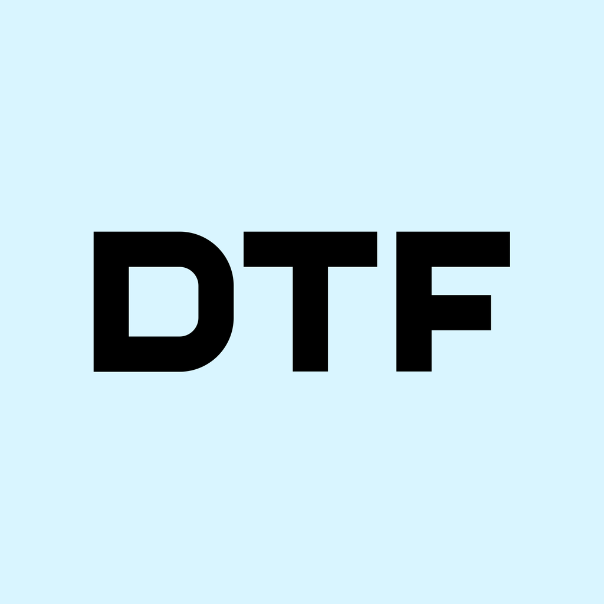
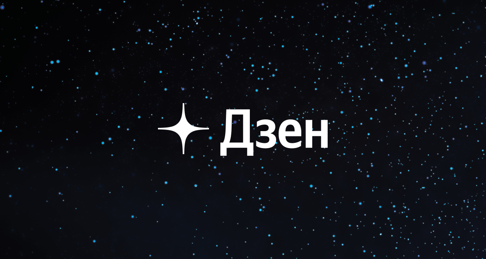

# NMF Articles
***

[Вернуться обратно](index.html)

***
## О сервисе
***

**NMF Articles – это сервис рекомендаций статей, которые тщательно отбираются редакцией нашей команды.**  
**Здесь вы найдете статьи на следующие темы: кинематограф, игровая индустрия, финансы, техника, дизайн, медиа и многие другие.**  
**С каких ресурсов мы будем рекомендовать вам статьи: DTF, vc.ru, Дзен и других.**

***
### Количество подписчиков онлайн-кинотеатров на уровне начала года, "Кинопоиск" снова в лидерах – итоги 2022 года от GfK
***

[Ссылка на статью](https://vc.ru/media/594974-kolichestvo-podpischikov-onlayn-kinoteatrov-na-urovne-nachala-goda-kinopoisk-snova-v-liderah-itogi-2022-goda-ot-gfk)

***
### Главную роль в байопике о Майкле Джексоне сыграет его племянник Джафар
***

[Ссылка на статью](https://dtf.ru/cinema/1599714-glavnuyu-rol-v-bayopike-o-maykle-dzheksone-sygraet-ego-plemyannik-dzhafar)

***
### Астрономы увидели в неожиданном появлении астероида угрозу для Земли
***

[Ссылка на статью](https://dzen.ru/a/Y9c3HJdM9RGpA5Uj)

***
### Кто и зачем начал отменять Atomic Heart?
***

[Ссылка на статью](https://dtf.ru/s/695867-atomic-heart/1597443-kto-i-zachem-nachal-otmenyat-atomic-heart)

***
### Кто и зачем начал защищать Atomic Heart, когда разработчики дискредитировали сами себя?
***

[Ссылка на статью](https://dtf.ru/u/344984-sunlighthell/1599973-kto-i-zachem-nachal-zashchishchat-atomic-heart-kogda-razrabotchiki-diskreditirovali-sami-sebya)

***
# Copyright © 2023 Nora Media Foundation Group